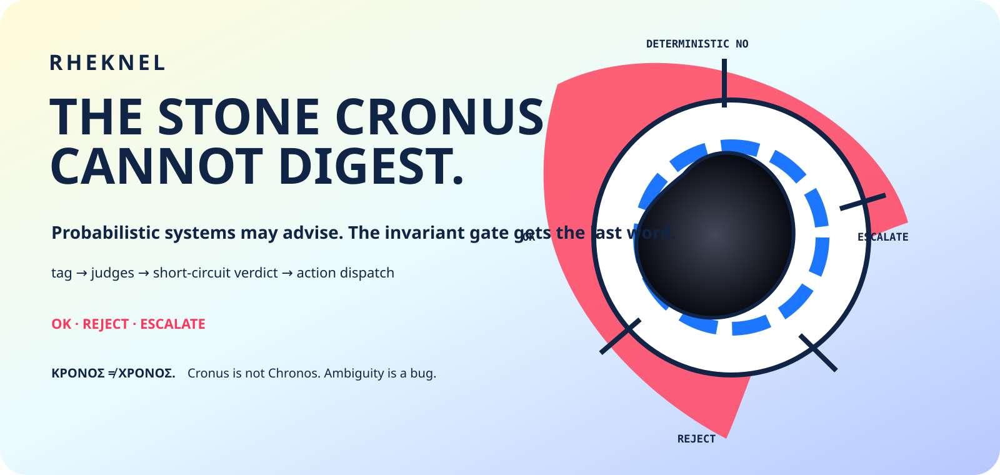

<p align="center">
  
</p>

<h1 align="center">RHEKNEL</h1>
<p align="center"><strong>A thousand eloquent models. One small, stubborn no.</strong></p>
<p align="center"><em>The ambition: put the boundary where the effect begins.</em></p>

<p align="center">
  <a href="kernel.c">Read the prototype</a> ·
  <a href="https://github.com/timelabs-npo/rheknel/pull/4">ABI integration work</a> ·
  <a href="SAFETY_Manifesto.en.md">Safety Manifesto</a> ·
  <a href="https://blueshoes.space/rhea/">Family map</a>
</p>

Rheknel researches a tiny deterministic boundary between a proposal and an action. Intelligence can generate possibilities by the million. The machine still needs an exact answer to **“may this effect happen?”**

**Current main:** a small C11 dispatcher prototype with static registries, three verdicts and a demonstration caller. It is **not yet a fail-closed admission boundary**: an unknown judge tag returns `OK`, and callers can invoke action dispatch directly. Those behaviors are visible in [the source baseline](https://github.com/timelabs-npo/rheknel/blob/c07ca8384259b613f81cba197fb749f52b86d10f/kernel.c#L114).

## The door matters more than the speech

Imagine an assistant proposing to replace a saved file. Its explanation may be excellent. The file owner still needs to check the target, permission and intended change before anything is written.

The interesting question is not how convincing the explanation sounds. It is whether **every path to the write passes through the same check**.

That is Rheknel's territory: a boundary small enough to inspect, explicit enough to challenge, and eventually strict enough that a persuasive paragraph cannot redraw it.

The current demonstration makes one caller ask its judges before invoking a callback:

```text
                       demonstration caller
                                │
                          registered judges
                                │
                 ┌──────────────┼──────────────┐
                 ▼              ▼              ▼
                OK            REJECT        ESCALATE
                 │              │              │
                 ▼              └──── stop ────┘
          tagged callback
```

The program's action is a printed demonstration message. It does not write that imagined file or authorize a physical actuator.

## Topology exposes the side door

In this context, **topology** means the structure of possible calls: which input can reach which judge, and which caller can reach an effect. A gate on the front door is insufficient if another call goes straight to the callback.

**Geometry** becomes useful when the surrounding system chooses how to compare candidate actions: perhaps their cost, delay or reversibility. Those comparisons can guide a proposal. They cannot grant it authority. The fixed registry sizes here bound storage; they are not a geometry of trust or a mathematical safety proof.

**Flow** is the actual passage from proposal to decision to effect. The security question is brutally concrete: where can that passage evade the intended check?

Rheknel's goal is to make that question answerable from a small, testable interface. **Shrink the place where power changes hands. Make it difficult to hide a second one.**

## What the prototype contains

| Piece | Present behavior |
|---|---|
| Static registries | Up to 16 action tags and 16 judge tags, with up to 8 callbacks per tag |
| Tagged registration | Action and judge callbacks stored without heap allocation in this path |
| Three verdicts | `RHEA_OK`, `RHEA_REJECT`, `RHEA_ESCALATE` |
| Judge iteration | Stops at the first non-OK result from a registered judge |
| Demonstration policy | A literal-string heuristic, not semantic validation |
| Action dispatch | Calls registered callbacks; the caller is responsible for invoking a judge first |

The details fit in [one C file](kernel.c). Small enough to read is a useful starting point. Small enough to certify is a separate achievement.

## The gaps are part of the map

Two present behaviors prevent the strongest claim:

- **Missing judge → `OK`.** An unregistered judge tag does not deny the request. See [`rhea_judge`](https://github.com/timelabs-npo/rheknel/blob/c07ca8384259b613f81cba197fb749f52b86d10f/kernel.c#L114).
- **Direct emit → callbacks.** [`rhea_emit`](https://github.com/timelabs-npo/rheknel/blob/c07ca8384259b613f81cba197fb749f52b86d10f/kernel.c#L125) does not itself require a successful judgment. The demonstrated caller's discipline is not universal enforcement.

The included judge rejects a couple of literal substrings. That is a teaching example, not a prompt-injection defense or truth oracle.

The next boundary must make missing, malformed and unauthorized inputs explicit failures; bind decisions to typed operations and evidence; and keep the executor separate. Those are engineering obligations, not properties bestowed by this README.

## Build and inspect

From the repository root, with GCC and Make available:

```bash
make -f Make build
make -f Make run
```

The build file is named [`Make`](Make), and its target compiles `kernel.c` using C11 flags. Running it exercises the demonstration only. The source does not currently establish formal verification, timing guarantees, production kernel integration or hardware safety qualification.

The [Omnia ABI integration PR #4](https://github.com/timelabs-npo/rheknel/pull/4) contains a separate C99 consumer and fail-closed integration effort with its own tests and receipts. It remains an unmerged workstream at this facade's source snapshot; inspect its commit and evidence together. Its behavior must not be attributed to this main-branch prototype.

## The larger circuit

| Neighbor | Relationship |
|---|---|
| [Rhea / Tribunal](https://github.com/timelabs-npo/rhea-project) | proposals, disagreement and staged authority contracts |
| [Omnia Playbook](https://github.com/timelabs-npo/omnia-playbook) | operational invariants and diagnostic knowledge |
| [Omnia Vault](https://github.com/timelabs-npo/omnia-vault) | state and evidence-preservation research |
| [Blueshoes](https://github.com/timelabs-npo/Blueshoes) | proposed network effects that need their own executor and result evidence |
| [MBSD](https://github.com/timelabs-npo/mbsd) | operating-substrate research with a separate hardware qualification boundary |

These are intended relationships. Model agreement does not supply authorization, and an admission decision does not prove that an executor succeeded.

## Why the stone?

In the Rhea myth, Cronus swallows a wrapped stone in place of the child. Our emblem borrows its stubbornness: the categorical object a surrounding appetite cannot turn into something else.

The metaphor earns its place only when the implementation can hold the boundary.

[Decisions](decisions.md) · [Protocol 0](0protocol.ru.md) · [MIT license](LICENSE) · Timelabs NPO

---

<p align="center"><strong>LET INTELLIGENCE ROAM. MAKE AUTHORITY PRECISE.</strong></p>
